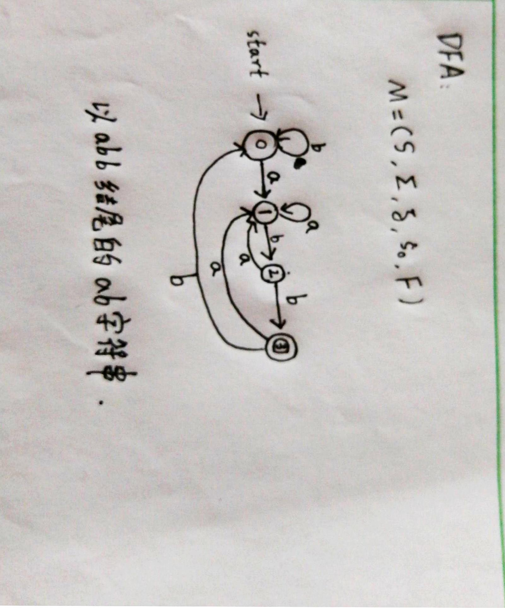
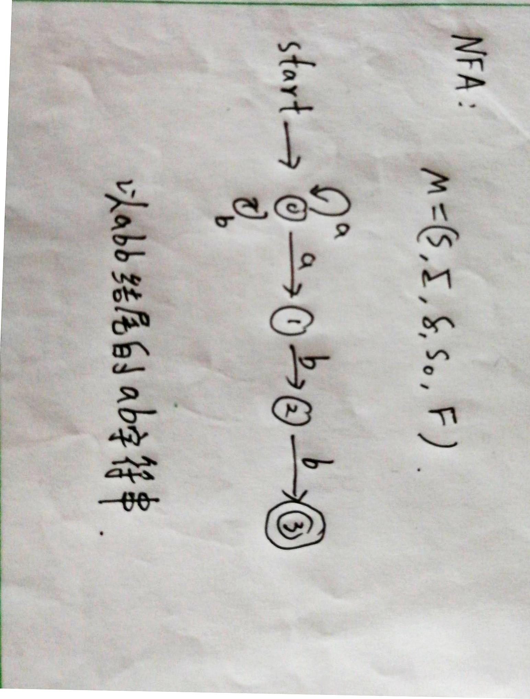
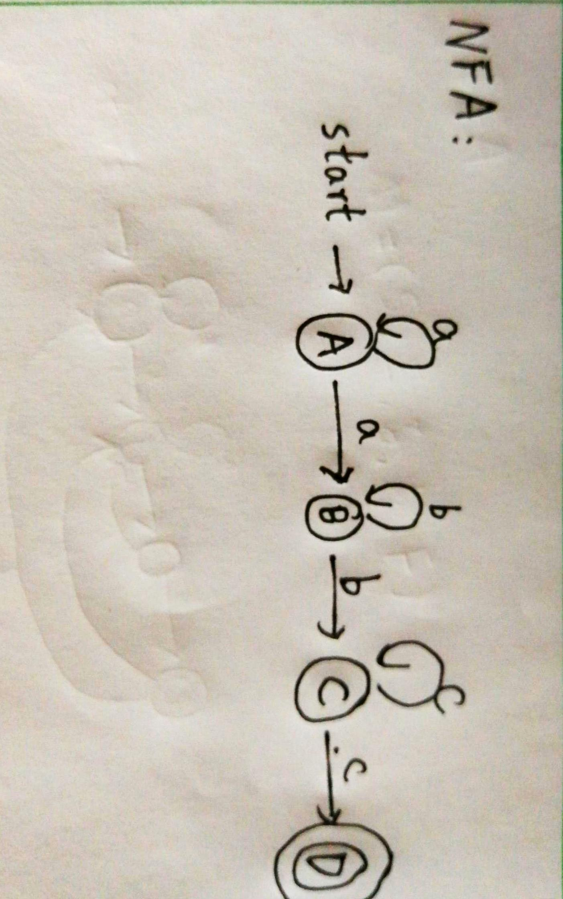
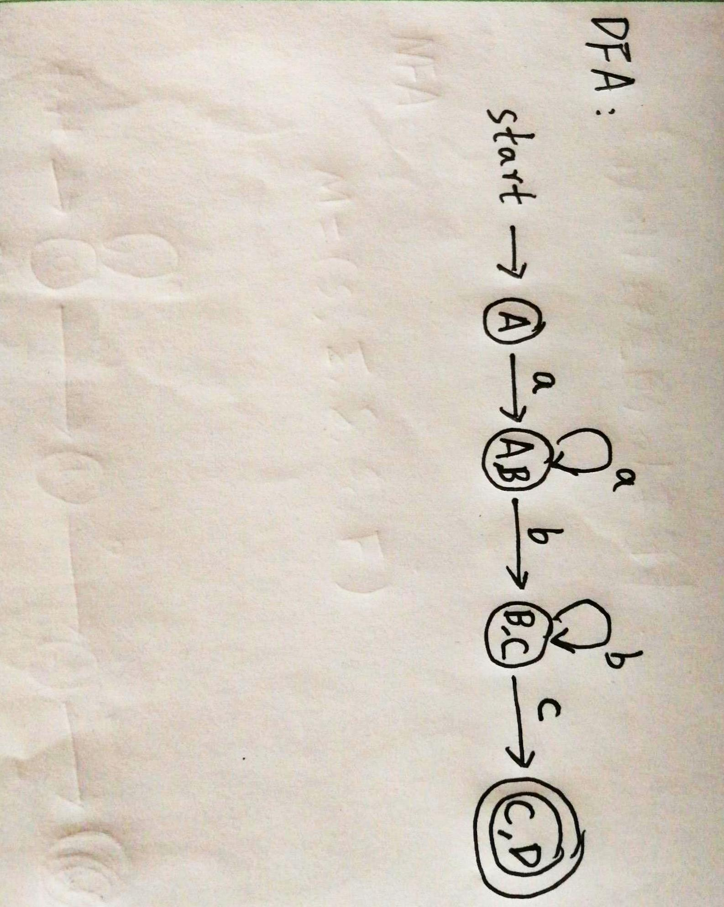
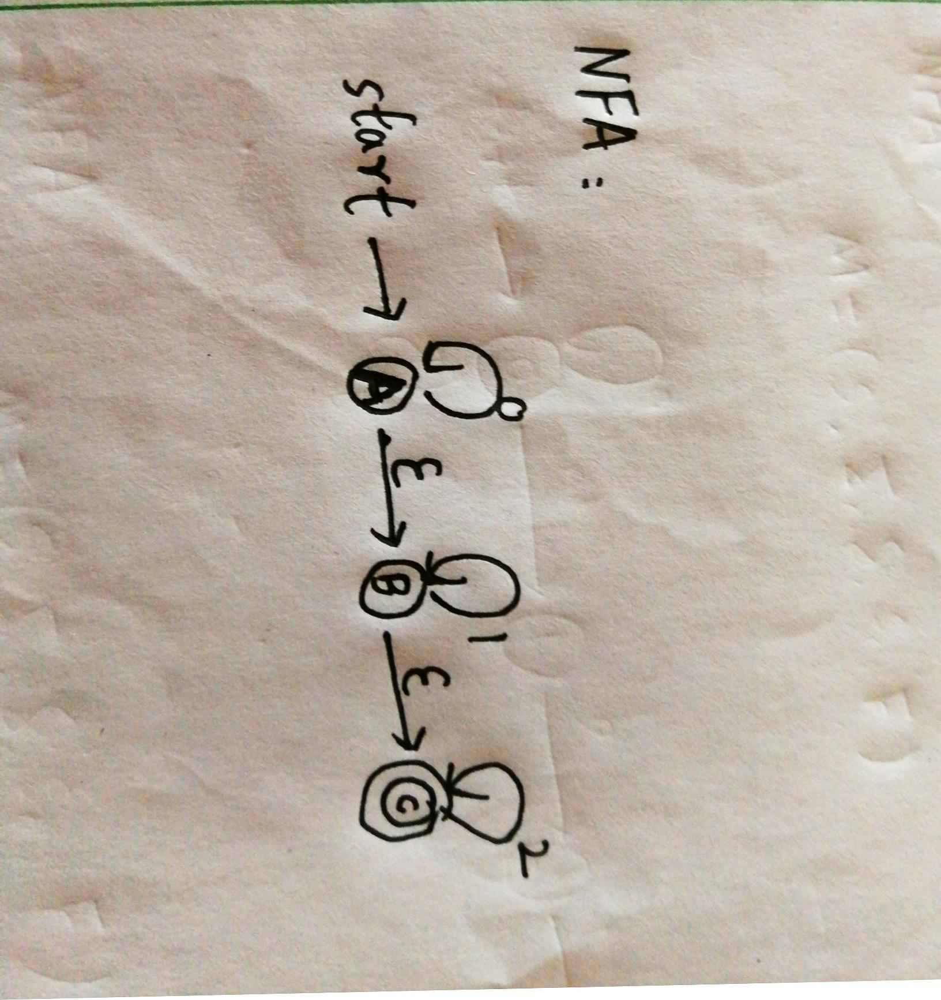
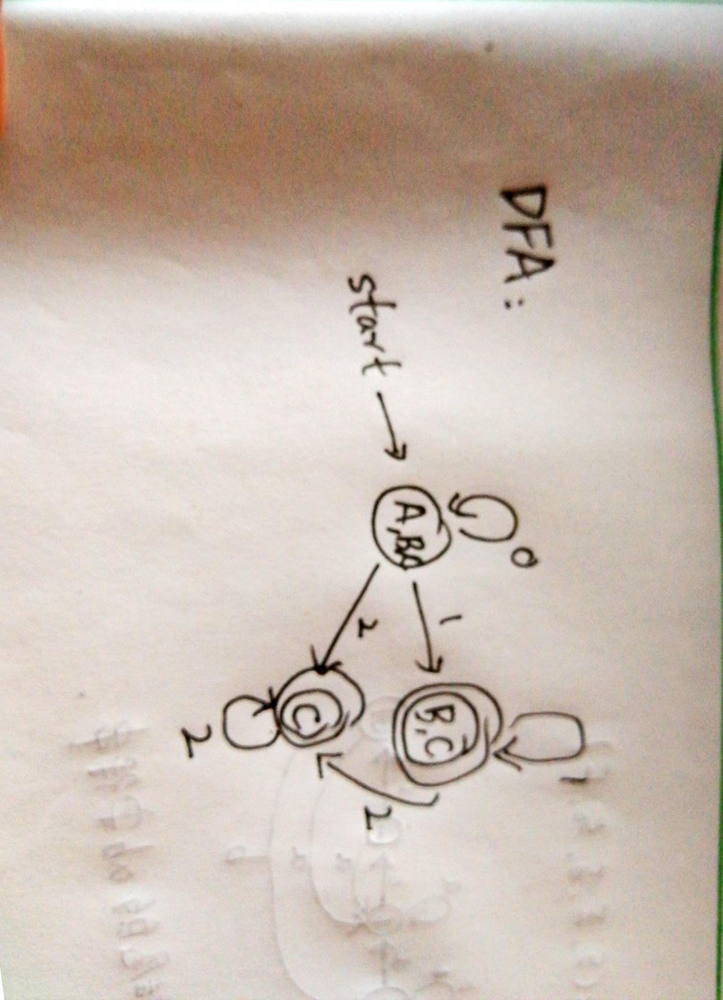
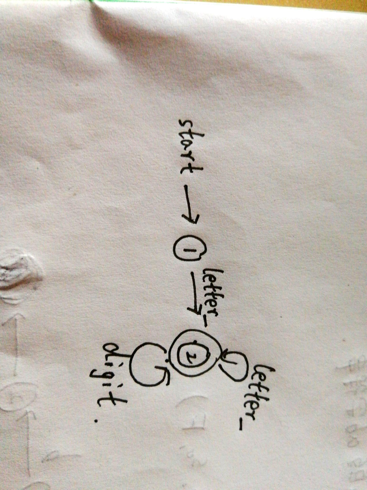

## Chapter 3 词性分析

### 3.1 正则表达式

#### 例子：

语言L = {a}{a,b}*({kong}huo{a,b}{a,b}*)

- 正则表达式可以由较小的正则表达式按照特定规则递归地构建。

#### 正则表达式的定义

- 空串是一个RE，L（空） = {空}
- 运算优先级：由高到低：*、连接、|
- 可以用正则表达式定义的语言叫做正则语言或正则集合

#### 正则表达式的代数定律

- |是可以交换的
  - r|s=s|r
- |是可以结合的
  - r|(s|t)=(r|s)|t
- 连接是可结合的
  - r(st) =(rs)t
- 连接对|是可分配的
  - r(s|t) = rs|rt
- 空串是连接的单位元
  - kongr = rkong =r
- 闭包中一定包含空串
  - r* = (r|kong)*
- *具有幂等性
  - r** = r\*

#### 正则文法与正则表达式等价

### 3.2 正则定义

- 给一些正则表达式命名，并在之后的正则表达式中像使用字母表中的符号一样使用这些名字。

#### 例子

##### C语言中的标识符的正则定义

- digit --->0|1|2|……|9
- letter_ ---> A|B|…|Z|a|b|…|z|_
- id ---> letter\_(letter_|digit)*
- 字母打头的字母数字串

##### 整型或浮点型，无符号数的正则定义

- digit ---> 0|1|2|…|9
- digits ---> digit digit*
- optionalFraction ---> .digits|kong
- optionalExponent ---> (E(+|-|kong)digits)|kong
- number ---> digits optionalFeaction optionalExponent

### 3.3 有穷自动机

- 有穷自动机是对一类处理系统建立的数字模型
  - 这类系统具有一系列离散的输入输出信息和有穷数目的内部状态。
  - 系统只需要根据当前所处的状态和当前面临的输入信息就可以决定系统的后继行为。每当系统处理了当前的输入后，系统的内部状态也将发生改变。

#### 实际例子

- 电梯控制装置
  - 输入：顾客的乘电梯的需求
  - 状态：电梯所处的层数+运动方向
  - 电梯控制装置并不需要记住先前全部的服务要求，只需要知道点滴当前所处的状态以及还没有满足的所有服务请求。

#### FA模型

- 输入带：用来存放输入符号串
- 读头：从左向右逐个读取输入符号，不能修改，也不能往返移动
- 有穷控制器：具有有穷个状态数，根据当前状态和当前输入符号控制转入下一状态

#### FA的表示

- 转换图
  - 结点：FA的标志（状态
    - 初始状态：只有一个，由start箭头指向
    - 终止状态：可以由多个，用双圈表示
  - 带标记的有向边：如果对于输入a，存在一个从状态p到状态q的转换，就在p、q之间有一个有向边，标记为a。

#### FA定义的语言

- 给定输入串x，如果存在一个对应于串x的从初始状态到某个终止状态的转换序列，则称串x被该FA接收。

#### 最长子串匹配原则

### 3.4 有穷自动机的分类

#### DFA 确定的有穷自动机

- 有穷状态集
- 输入字母表
- 转换函数
- 开始状态/初始状态
- 接收状态/终止状态

##### 举例：DFA

- 以abb结尾的ab字符串
- 转换表

| 状态/输入 | a    | b    |
| --------- | ---- | ---- |
| 0         | 1    | 0    |
| 1         | 1    | 2    |
| 2         | 1    | 3    |
| 3（终态） | 1    | 0    |

- DFA图



#### NFA 非确定的有穷自动机

- 有穷状态集
- 输入字母表
- 转换函数 --->这里体现差异
- 开始状态/初始状态
- 接收状态/终止状态

##### 举例：NFA

- 以abb结尾的ab字符串
- 转换表

| 状态/输入 | a     | b    |
| --------- | ----- | ---- |
| 0         | {0,1} | {0}  |
| 1         | 空集  | {2}  |
| 2         | 空集  | {3}  |
| 3（终态） | 空集  | 空集 |

- NFA图



#### DFA和NFA的等价性

- 对任何NFA ,存在识别同一语言的DFA
- 对任何DFA ,存在识别同一语言的NFA

##### 举例：识别同一语言的DFA和NFA

#### DFA的算法实现

- 输入：以文件结束符eof结尾的字符串x，DFA D的开始状态s，接收状态集F，转换函数move。

- 输出：如果D接收x，则回答“yes"，否则回答"no"。

- 方法：伪代码体现思路：

  ```c
  s = s0; //s0代表开始状态
  c = nextChar();
  while(c!=eof){
      s=move(s,c);
      c=nextChar();
  }
  if(s in F) return "yes";
  else return "no";
  ```

  ```
  函数说明：
  函数nextChar()返回输入串x的下一个符号
  函数move(s,c)表示从状态s出发，沿着标记为c的边所能到达的状态
  ```

### 3.5 从正则表达式到有穷自动机

#### 思路：

- 由正则表达式转换为NFA
- 由NFA转换为DFA

#### 举例：

##### 空串对应的NFA


##### 字母表中符号a对应的NFA


##### 正则表达式克林闭包对应的NFA

### 3.6 从NFA到DFA的转换

#### 举例：

##### 例子  r = aa\*bb\*cc\*



- 对应转换表

| 状态/输入 | a     | b     | c     |
| --------- | ----- | ----- | ----- |
| A         | {A,B} | 空集  | 空集  |
| B         | 空集  | {B,C} | 空集  |
| C         | 空集  | 空集  | {C,D} |
| D*(终态)  | 空集  | 空集  | 空集  |



##### 带有空边的NFA到DFA的转换

r = 0\*1\*2*

NFA:



转换表

| 状态/输入 | 0       | 1     | 2    |
| --------- | ------- | ----- | ---- |
| A         | {A,B,C} | {B,C} | {C}  |
| B         | 空集    | {B,C} | {C}  |
| C*(终态)  | 空集    | 空集  | 空集 |

DFA:



#### 子集构造法

- 输入：NFA N

- 输出：接收同样语言的DFA D

- 方法：

  - DFA的每个状态都是NFA状态集合的子集

  伪代码思路：

  ```
  一开始，空闭包是Dstatus中的唯一状态，且它未加标记；
  while(在Dstatus中有一个未标记状态T){
      给T加上标记;
      for(每个输入符号a){
          U = 空闭包函数（move(T,a)）;//检测T在接收a后是否是闭包循环
          if(U不在Dstatus中)
          	将U加入且不做标记；
          	Dtran[T,a] = U;
      }
  }
  ```

  ```
  空闭包函数：
  将T的所有状态压入栈中；
  将空闭包初始化为T；
  while(栈非空){
      将栈顶元素取出;
      for(每个满足如下条件的u：从t出发有一个标号为kong的转换到达状态u){
          if(u不再空闭包T内){
              将u加入到T内；
              将u压入栈中;
          }
      }
  }
  ```

### 3.7 识别单词的DFA

#### C语言中的标识符的DFA

- digit --->0|1|2|……|9
- letter_ ---> A|B|…|Z|a|b|…|z|_
- id ---> letter\_(letter_|digit)*

)

#### 整型或浮点型，无符号数的DFA

- digit ---> 0|1|2|…|9
- digits ---> digit digit*
- optionalFraction ---> .digits|kong
- optionalExponent ---> (E(+|-|kong)digits)|kong
- number ---> digits optionalFeaction optionalExponent

#### 识别各进制无符号整数的DFA

- DEC---> (1|…|9)(0|…|9)*|0
- OCT--->0(1|…|7)(0|…|7)*
- HEX--->Ox(1|…|F)(0|…|F)*

#### 识别注释的DFA

#### 识别Token的DFA

#### 词法分析阶段的错误处理

- 词法分析阶段可检测无措的类型
  - 单词拼写错误
  - 非法字符
- 语法错误检测
  - 如果当前状态与当前输入符号在转换表对应项中的信息为空。

#### 错误处理

- 查找已扫描字符串中最后一个对应于某终态的字符
  - 如果找到了，将该字符与其前面的字符识别成一个单词，然后将输入指针返回到该字符，扫描器重新回到初始状态，继续识别下一个单词
  - 如果没找到，则确定出错，采用错误恢复策略

##### 错误恢复策略

- 恐慌模式
  - 从剩余的输入中不断删除字符，直到词法分析器能够在剩余输入的开头发现一个正确的字符为止