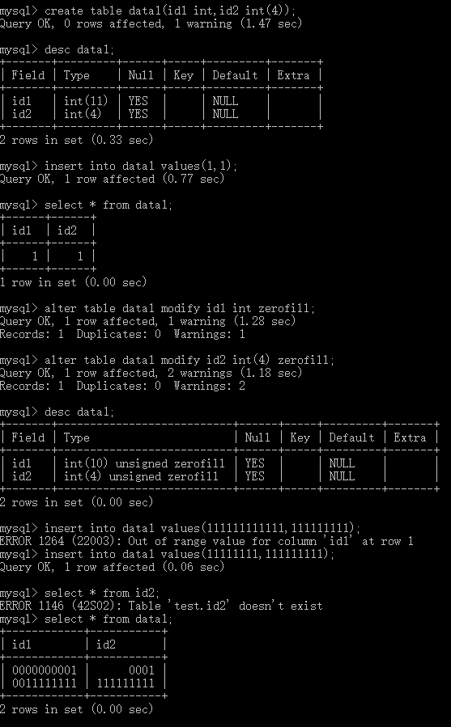
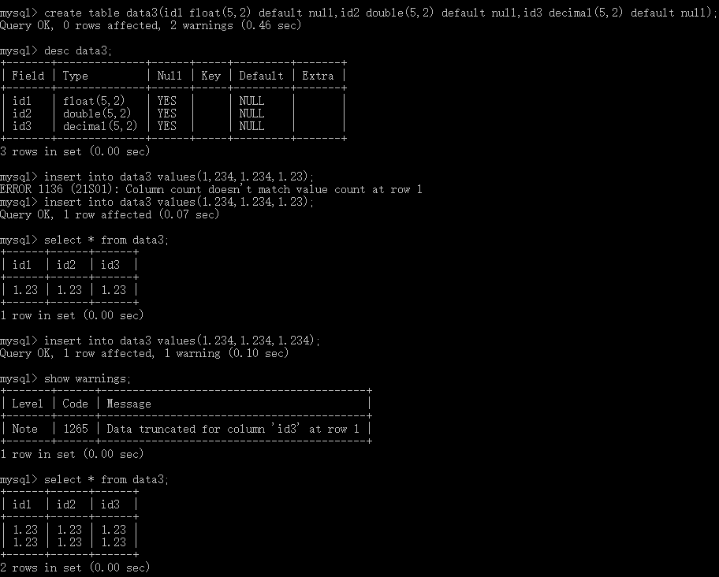
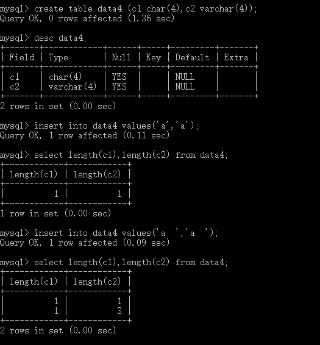

# MySQL支持的数据类型

- 数据类型用来指定一定的存储格式、约束和有效范围

## 数值类型

- 支持所有SQL中的数值类型
  - 严格数值类型【INTEGER（4字节、SMALLINT（2字节、DECIMAIL（M+2字节、NUMERIC
  - 近似数值类型【FLOAT（4字节、REAL（8字节、DOUBLE（8字节、PERCISION
  - 扩展增加【TINYINT（1字节、MEDIUMINT（3字节、BIGINT（8字节

- 其中常用划分
  - 整数类型
  - 浮点数类型
  - 定点数类型
  - 位类型

当超过类型范围会报错“Out of range”

- 对整型类型，支持在类型名称后面的小括号内指定显示宽度

### 一些属性

#### 整数

- 在填充时涉及关键字zerofill 【在数字位数不够的空间用字符"0"填充

> eg:创建表data1，有id1 int 和 id2 int(4) 查看有无zerofill的区别
>
> ` create table data1(id1 int,id2 int(4));` 建表
>
> ` insert into data1 values(1,1);`插入数据测试
>
> ` alter table data1 modify id1 int zerofill;` 修改表解构加上zerofill
>
> ` alter table data1 modify id2 int(4) zerofill;`
>
> ` insert into data1 values(111111111111,11111111);`
>
> ` insert into data1 values(1111111,1111);`
>
> 
>
> - 可以看出zerofill对于插入数据不会有影响，保存精度也没有改变，只是填充0

- 在需要产生自动增加的 AUTO_INCREMENT 只用于整数类型，且该列必须定义为主键或UNIQUE键且NOT NULL

> eg: 建表data2，id列使用AUTO_INCREMENT
>
> ` create table data2(id int auto_increment not null primary key);`
>
> 或`create table data2(id int auto_increment not null,primary key(id));`
>
> 或`create table data2(id int auto_increment not null,UNIQUE(id));`
>
> 

#### 小数

- 浮点数 【不写标度和精度会按照实际精度值显示，如果有但超过则四舍五入后的结果插入，不会报错

  - float单精度

    double双精度

- 定点数 【以字符串形式存放，不写精度和标度按默认的decimal(10,0)表示，如果超越了，系统会报错

  - decimal 

##### 使用

- ` 类型名称（M,D)`
- 其中M为共显示多少位数字【精度
- D为显示小数点后几位【标度

> eg: 创建表data3 查看三者
>
> ` create table data3(id1 float(5,2),id2 double(5,2),id3 decimal(5,2));`
>
> `insert into data3 values(1.234,1.234,1.23);`
>
> `insert into data3 values(1.234,1.234,1.234);`
>
> 

#### 位

- 用于存放字段位

## 日期时间类型

- 表示年月日，通常用DATE 字节4
- 表示年月日时分秒，通常用DATETIME 字节8
- 表示时分秒，通常用TIME 字节3
- 经常插入或更新日期用TIMESTAMP表示 字节4 【不设置会默认位当前系统日期，一个表内如果有两个TIMESTAMP属性，只给第一个自动默认位当前系统日期，后面的会置0 ，强制设置也不可设置两列的值默认都位当前系统日期
- 值表示年份 YEAR 1字节

#### 关于时间戳

- 与时区相关

> ` show variables like 'time_zone';`
>
> 查看当前时区

##### 2038年问题

- 2038年问题是32位系统的计算位数限制，会导致北京时间2038年1月19日中午11：14：07之后无法正常工作。
- 而64位的可以记录到2900亿年后。【所以，想留下点东西，请保存到64位的电脑上】

## 字符串类型

### CHAR VARCHAR

- 用来保存较短的字符串，两者区别在于存储方式不同，CHAR的长度固定为创建表时声明的长度，而VARCHAR的为可变长字符串
- char 会删除尾部的空格，varchar会保留

> eg: 通过建立表data4及操作查看区别
>
> `create table data4 (c1 char(4),c2 varchar(4));` 建表
>
> `insert into data4 values('a','a');` 
>
> `insert into data4 values('a  ','a  ');`
>
> `select length(c1),length(c2) from data4;`
>
> 

### BINARY VARBINARY

- 类似上者，包含二进制字符串，不包含非二进制字符串

### ENUM

- 枚举类型
  - 忽略大小写,还可用数字

> eg:建表data5查看枚举类型的插入
>
> ` create table data5(gender enum('M','F'));`
>
> `  insert into data5 values('M'),(1),(NULL);`
>
> 

### set

- 与上者类似，一次可选取多个包含在集合内的成员，重复的只取一次