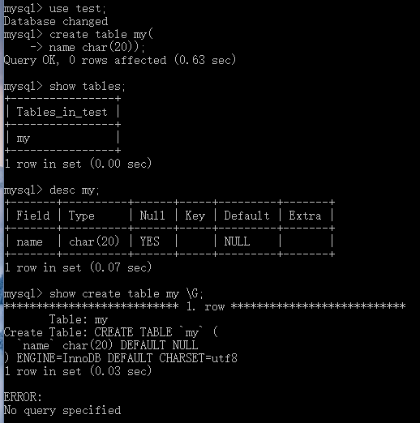
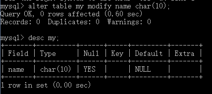
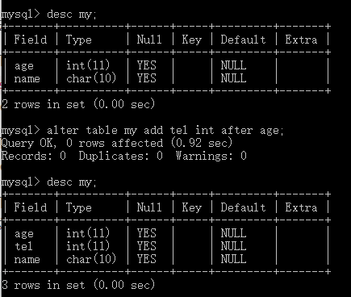

# SQL基础

- SQL：Structure Query Language 【结构化查询语言，适合和一些外行人显摆一下。】

### 个人补充：

- SQLServer 与MySQL的区别：
- MySQL与SQL的关系：

## （My）SQL使用入门

### SQL分类

- DDL:数据定义语言【create、drop、alter】
- DML:数据操纵语言【insert、delete、update、select】
- DCL:数据控制语言【grant、revoke】

### DDL语句

- 数据定义包括数据库、表

#### 数据库的创建、删除、查看

```mysql
create DATABASE databasename; //创建数据库
```

> 实例输入及结果：
>
> mysql内，所有的DDL和DML语言执行成功后都是显示“Query OK"
>
> 


```mysql
show databases;  //显示所有的数据库名称
```

> 注意：有以下库为安装后自动创建
>
> information_schema: 存储系统中的数据库对象信息【元数据信息
>
> - schemata 提供当前mysql实例中所有数据库的信息
> - tables 提供关于表的信息，详细表述了某个表属于哪个schema、表类型、表引擎
> - columns 提供表中的列信息
> - statistics 提供了关于表索引的信息
>
> cluster:存储系统的集群信息
>
> mysql:存储系统的用户权限信息    【忘记密码要修改的就是这个
>
> test:系统自动创建的测试数据库，任何用户都可以使用


```mysql
drop database databasename; //删除数据库
```

> 注意：不要遗漏了database，不要输错名字。


#### 表的创建、删除、查看、修改

- ADD增加字段默认是加在最后位置，CHANGE\MODIFY默认不改变字段的位置，都有可选项first|after column_name
- 注意：CHANGE/FIRST|AFTER COLUMN 这些关键字为MySQL在标准SQL上的扩展

```mysql
create TABLE tablename(
column_name column_type constraints,
column_name column_type constraints,
column_name column_type constraints)
```

>注意：创建表前要先用 use database databasename 选定数据库，不然会报错。
>
>创建表后
>
>可通过 `desc tablename;` 查询表的定义
>
>也可用 `show create table tablename \G;`查询更详细的定义信息。
>
>示例创建名为my的表并查看详情
>
>


``` mysql
drop table tablename; //删除表
```


```mysql
ALTER TABLE tablename MODIFY COLUMN_name column_definition; //修改表类型
```

>eg:修改my表name的数据类型 char(20) ->char(10)
>
>` alter table my name char(10);`
>
>


```mysql
ALTER TABLE tablename ADD COLUMN_NAME COLUMN_definition; //增加表字段
```

>eg:在my表增加字段age,数据类型为Int(2)
>
>` alter table my add age int(2); `
>
>
>
>eg:示例指定位置的增加表字段
>
>` alter table my add tel int after age; `
>
>


``` mysql
ALTER TABLE tablename Drop Column_name; // 删除表字段
```

> eg:在my表内删除字段name
>
> ` alter table my drop name; `
>
> 


``` mysql
ALTER TABLE tablename CHANGE old_colname col_name1 col_name1definition; //字段改名
```

>eg:修改my表内age字段名称改为age1
>
>` alter table my change age age1 int(2); `
>
>此格式注意修改后的字段属性即使不变动也要写上。
>
>
>
>change 可修改列名，modify 不可。


``` mysql
ALTER TABLE tablename RENAME tablename_new; //修改表名
```

>eg:将表名my→my1
>
>` alter table my rename my1`
>
>
>
>

### DML语句

#### 记录的增删查改

``` mysql
INSERT INTO tablename (field1,field2,…) VALUES(value1,value2,…) //插入记录
```

- 插入单条记录

>eg:向my表内插入数据age为10，tel为1111111，name为yyy
>
>` insert into my (age,tel,name) values (10,1111111,'yyy');`
>
>或不指定字段名称，排列顺序一致即可
>
>`insert into my values(10,1111111,'yyy'); `
>
>此外，含可空字段、非空但是有默认值的字段、自增字段，可以不用在Insert后的字段列表利出现，没写的会自动设置为NULL、默认字段、增加后字段。

- 插入多条记录

>eg:向my表内插入数据age为10，tel为1111111，name为yyy，age为20，tel为222，name为ccc
>
>` insert into my values(10,1111111,'yyy'),(20,222,'ccc');` 


``` mysql
UPDATE tablename SET field1=value1,field2=value2 where condition; //更新记录
```

- 更新单个表

> eg: 修改my表中name=ccc的记录的age 更改为30
>
> ` update my set age=30 where name = 'ccc';`

- 同时更新多个表中姓名相同的将tel修改为tel+1

>eg:修改my表和your表中tel相同的
>
>my: age 、tel、name
>
>your:tel、name
>
>`update my,your set my.tel = my.tel+1,your.tel = your.tel+1 where my.name=your.name;`


``` mysql
DELETE FROM tablename where condition; // 删除记录
```

>eg:删除my表中name=yyy的记录
>
>` delete from my where name='yyy';`
>
>注意：删除需要谨慎


``` mysql
SELECT * FROM tablename WHERE CONDITION; //查询记录
```

- 此处的`*`表示将所有的记录都选出来，也可以用逗号分隔的所有字段来代替。

> 查询不重复的记录
>
> - 可用distinct关键字
>
> eg: 查找my表内不重复的tel
>
> ` select distinct tel from my; `


> 条件查询
>
> - 使用where关键字
>
> eg:查找my表中name=ccc的记录的所有信息
>
> ` select * from my where name='ccc';`


>排序和限制
>
>- ORDER BY关键字，默认为升序排列，可跟多个不同的排序字段，靠前面的字段优先判断
>- DESC表示按照字段进行降序排列
>- ASC表示升序排列
>
>eg:将my表内数据按照age进行降序排列
>
>` select * from my order by age desc; `


> 只显示一部分记录【limit为MySQL扩展语法，不通用
>
> - 使用关键字limit 格式为limit offset_start row_count 默认起始偏移量为0
>
> eg:只显示my表的前2条数据
>
> ` select * from my limit 2;`


``` mysql
SELECT [field1,field2,…,] fun_name
FROM tablename
WHERE where_contition
Group BY field1,field2,…
WITH ROLLUP
HAVING where_contition; //聚合操作- 汇总
```

- fun_name 为聚合操作 即聚合函数
- group  by 关键字表示要进行分类聚合的字段
- WITH ROLLUP为可选语句，表明是否对分类聚合后的结果进行再汇总
- HAVING 表示对分类后的结果再进行条件的过滤

> eg:统计my表中name，及各个Name有多个项记录
>
> ` select name,count(*) name_num from my group by name;`
>
> eg:统计my表中name，及各个Name有多个项记录及总人数
>
> ` select name,count(*) name_num from my group by name with rollup;


##### 表连接

> 同时显示多个表中的字段

- 内连接

  - 仅选出两张表中互相匹配的记录

  > eg: 查询my表和your表中name 相同的所有记录
  >
  > ` select * from my,your where my.name=your.name;`

- 外连接

  > 还会选出不匹配的记录

  - 左连接

    - 包含所有左边表中的记录甚至是右边表中没有和它匹配的记录

    >eg:左连接
    >
    >` select * from my left join your on my.name=your.name;`

  - 右连接

    - 包含所有的右边表中的记录

    > eg:右连接
    >
    > ` select * from my right join your on my.name=your.name;`

  

##### 子查询

- 一些情况下，当进行查询时，需要的条件是另外一个select语句的结果

##### 记录联合

- 将多个结果直接合并在一起显示

### DCL语句

``` mysql
grant select on tablename to user ; //授权
```

``` mysql
revoke select on tablename from user ; //撤权
```

> 授权
>
> 


### mysql 自带的帮助文档的使用

- 显示所有可供查询的分类 ` ? contents`.【？与contents间有空格

- 查询格式为` ? 类别名称`
- 同理也可查命令 如` ? show `
- 

