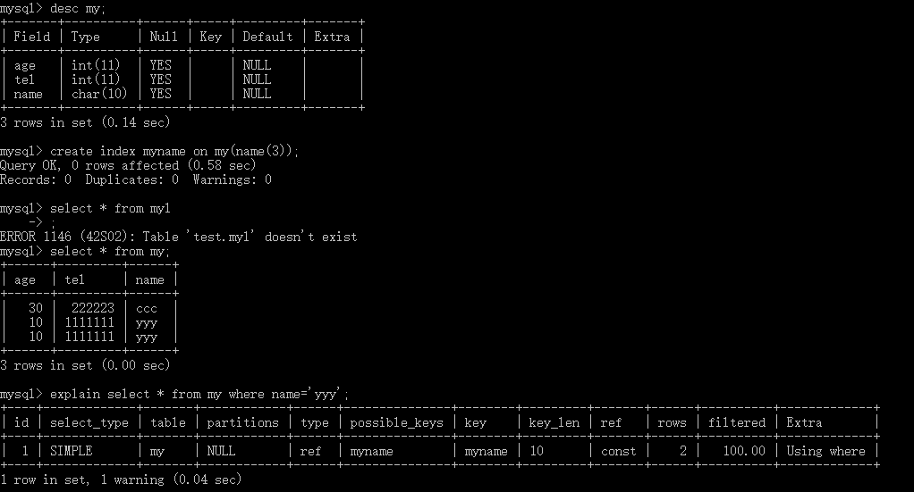

# 索引的设计和使用

> 索引用于快速找出某个列中有一特定值的行

## 索引概述

- 使用索引可以提高select的性能
- 根据存储引擎可以定义每个表的最大索引书和最大索引长度
- MyISAM和InnoDB存储引擎的表默认创建的都是BTREE索引
- MySQL目前不支持函数索引，但支持前缀索引
- MySQL支持全文本索引，该索引可以用于全文搜索，5.0版本的MySQL只有MyISAM存储引擎支持全文索引，并且只限于CHAR、VARCHAR、TEXT列
- 索引总是对整个列进行，不支持局部索引

### 创建索引

``` mysql
create [unique|fulltext|spatial] index index_name
[using index_type]
on table_name(index_col_name)

index_col_name:col_name[(length)][ASC|DESC]
```

> 举例：为my表创建3个字节的前缀索引
>
> ` create index myname on my(name(3));`
>
> 查看索引使用：` explain select * from my where name='yyy';`
>
> 

### 删除索引

``` mysql
drop index index_name on table_name;
```

## 设计索引原则

- 适合索引的列是出现在WHERE子句中的列，或连接子句中指定的列，不是select关键字后的选择列表中的列
- 使用唯一索引，即列内保存的值具有不同值，容易区分
- 使用短索引
- 利用最左前缀
- 不要过度索引，每个额外的索引都要占用额外的磁盘空间，降低写操作的性能
- InnoDB会默认按照一定的顺序保存，如果由明确定义的主键，就按主键顺序保存，如果没有，就按照唯一索引保存，如果两个都没有就会自动生成一个内部列，尽量自己指定主键，其普通索引也会保存主键的键值，主键要尽量短

## BTREE 索引和HASH索引

> MEMORY存储引擎的表可以选择使用BTREE索引或者HASH索引

### HASH索引

#### 特征

- 只用于使用=或<=>操作符的等式比较
- 优化器不能使用HASH索引来加速ORDER BY操作
- MySQL不能确定再两个值之间大约有多少行。如果将一个MyISAM表改为HASH索引的MEMORY表，会影响一些查询的执行效率
- 只能使用整个关键字来搜索一行

### BTREE索引

#### 特征

- 当使用>,<,<=,>=,between,!=或<>或like操作符时，都可以使用相关列上的索引

### 一些情况

- 适用于BTREE和HASH

> ` select * from t1 where key_col = 1 or key_col in (15,18,20);`

- 只适用于BTREE

> ` select * from t1 where key_col >1 and key_col<10;`

- 当对索引字段进行范围查询时，只有BTREE索引可以通过索引访问，而HASH索引实际上是全表扫描