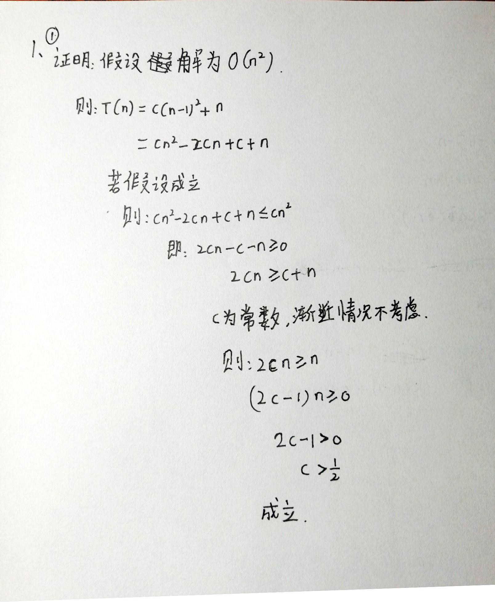
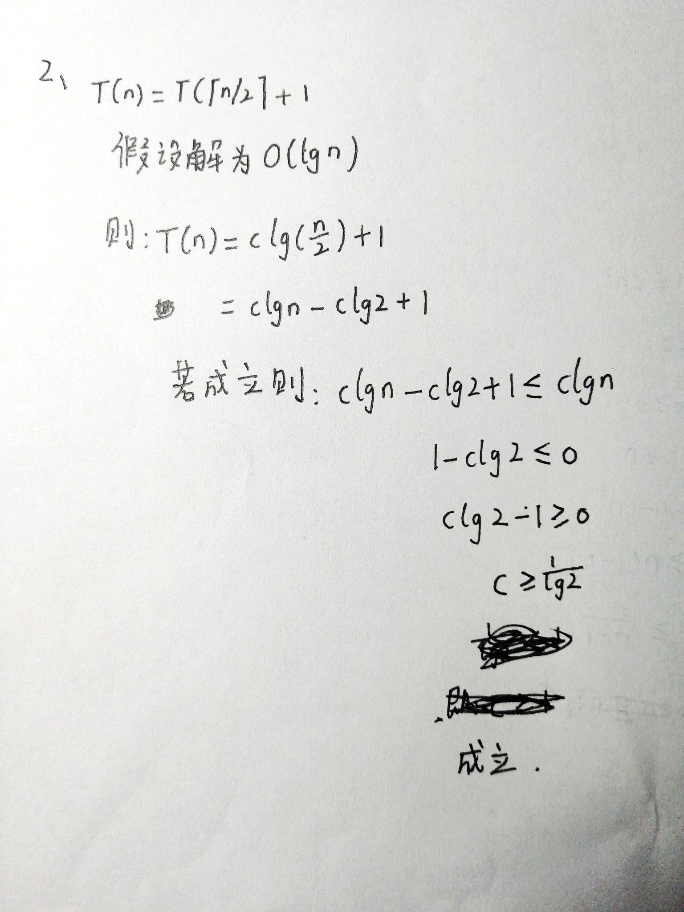
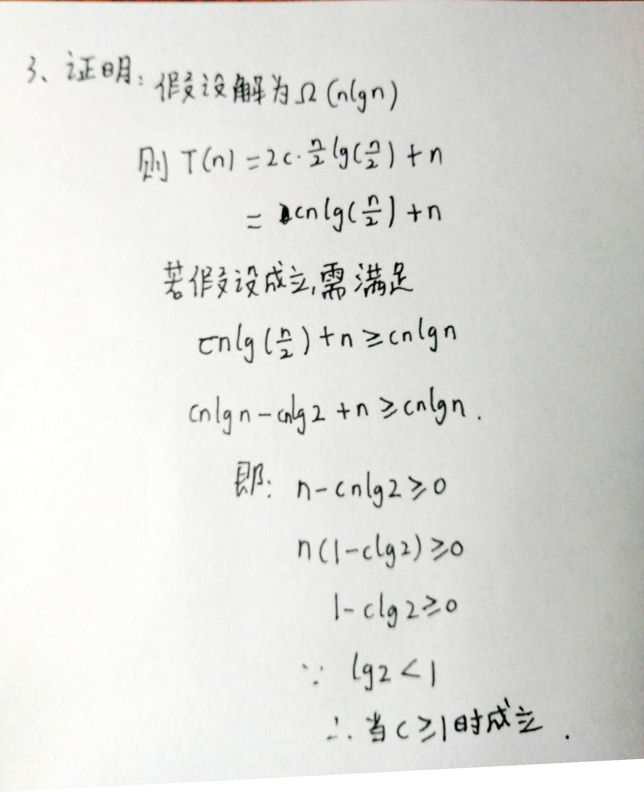
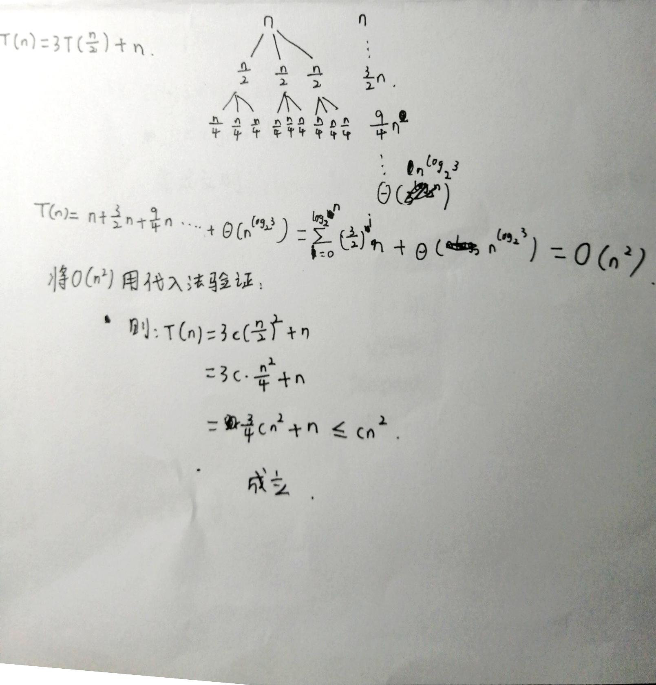
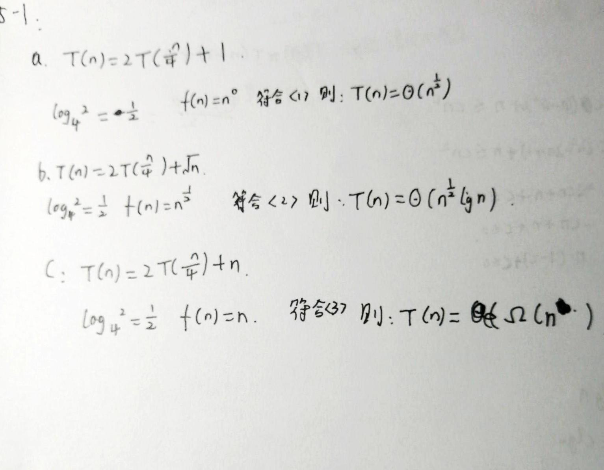

# 渐进符号、递归及解法

## 渐进符号

### O记号【表达运行时间的上界

- 公式化定义：O(g(n)) = {f(n):存在正常量c和n0,使得对所有n>=n0,有0<=f(n)<=cg(n)}

> eg: 
> $$
> f(n) = n^3 + \omicron(n^2)
> $$
> 该公可以理解为有一个h(n)属于集合O(n^2)，满足f(n) = n^3 + h(n)，等号不是对等关系，是一种属于、包含关系。

### Ω记号【表达运行时间的下界

- 公式化定义：Ω(g(n)) = {f(n):存在正常量c和n0,使得对所有n>=n0,有0<=cg(n)<=f(n)}

> eg:
> $$
> \sqrt n = Ω(lgn)
> $$

### Θ记号

- 给出一个函数的上界和下界
- Θ(g(n)) = O(g(n)) ∩ Ω(g(n))

## 求解递归式

### 代换法

#### 步骤

- 猜答案【猜答案的形式
- 用数学归纳法验证是否满足并求出解中的常数

#### 注意

> O不能用来代换
>
> 由于基本情况，T(1) = Θ(1)，c1要相对于c2足够大

#### 改进归纳法

- 加入适当的低阶

#### 一些练习：

> 1、证明：T(n)=T(n-1)+n的解为O(n^2)
>
> 我的解答：
>
> 2、证明：T(n)=T([n/2])+1的解为O(lgn)
>
> 我的解答:
>
> 3、证明Ω(nlgn)是T(n)=2T([n/2])+n的解
>
> 

### 递归树法

- 按照递归式构造递归树

#### 一些练习：

> 1、对递归式T(n)=3T(n/2)+n利用递归式确定一个好的渐进上界，用代入法进行验证。
>
> 

### 主方法

- 应用于特定的递归式中

- $$
  T(n) = aT(n/b) +f(n)      其中a\geq1和b<1
  $$

#### 三种情况

> 见黑皮书p54

- f(n)比n^(logb(a))增长的慢，T(n) = Θ(n^logb(a)) 【多项式意义上的小于
- f(n) = Θ(n^(logb(a))),T(n) = Θ(n^logb(a)*lgn)
- f(n)比n^(logb(a))增长的快，T(n) = Θ(f(n))

##### 注意：

- 有存在于三种情况间隙间的情况，不可用主方法求解，比如是小于但不是多项式意义上的小于，是大于但不是项式意义上的大于

#### 一些练习：

> 